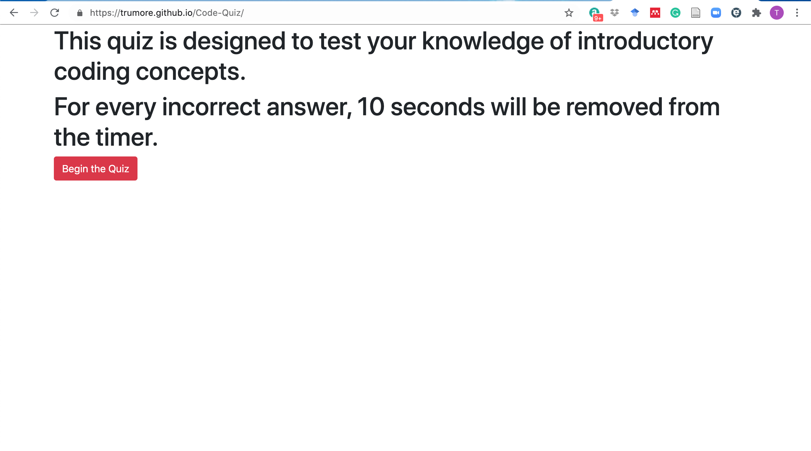
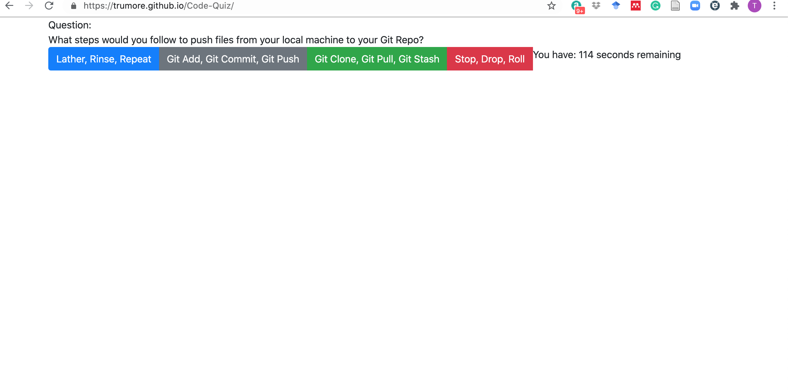
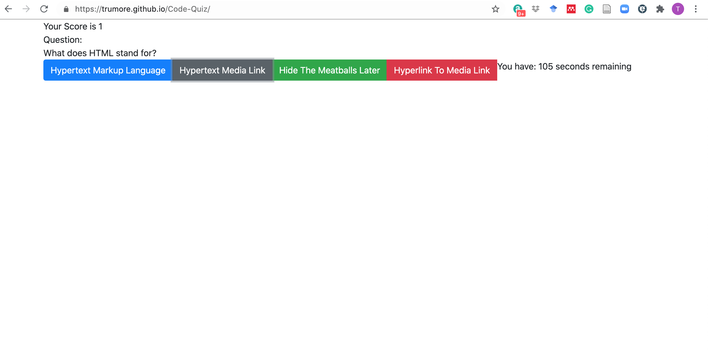

# Code-Quiz

The intent of this project was to create a coding quiz that reflects on the information we had been taught to date in our bootcamp class. As the user clicks begin, the quiz cycles through a series of questions with multiple choice answers while updating the user's score.

Instructions - The quiz is initiated when the user clicks begin. Once the user clicks begin, the container is his, and displays the quiz body. As the user is presented with a single multiple choice question at a time, a timer is counting down from 120 seconds. When the user clicks on an answer, the next question appears. If the answer was correct, an updated score is shown giving the user 1 point. If the answer was incorrect, 10 seconds is subtracted from the clock. If the clock runs to 0, the user is prompted that they are finished and are instructed to enter their initials and score.

Built using: HTML, CSS, and Javascript.

Link to page: https://trumore.github.io/Code-Quiz/

Screenshot:

Credits - Built by Tom Rumore and with collaboration with the CU-NYC-FSF-PT-10-2020-U-C Study Group
